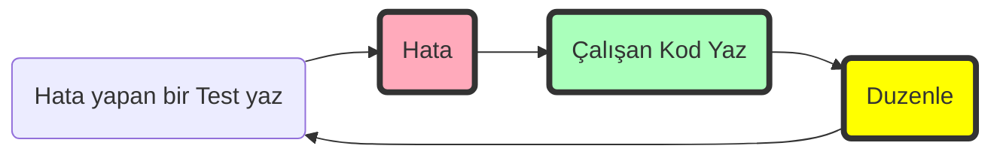

# Kod-yazma-becerini-gelistirecek-20-ipucu
Programlama yeteneğini iyileştirmek istiyorsan **BUNLARI YAP**

## Hata > Çalışan Kod > Yeniden Düzenleme

Refactor: mevcut bir kodu yeniden yapılandırmak, dış davranışını değiştirmeden iç yapısını değiştirmek ve geliştirmek için kullanılan bir tekniktir. ChatGPT ye `refactor: ` komutu verip yeni satıra kodu yapıştırmanız yeter.
  

**Kodlama becerilerinizi değiştirecek 40 ipucu**
1.  Kodu alın ve büyük kod parçalarını küçük fonksiyonlara ayırın.
2.  İşe ayırdığınız zamana kadar sorunu çözmediyseniz. Bilgisayarı kapatın ve ertesi güne bırakın. Artık sorun hakkında düşünmeyin.
3.  **[YAGNI](https://en.wikipedia.org/wiki/You_aren%27t_gonna_need_it)** Prensibi: sizden istenenden daha fazlasını kodlamayın. Geleceği tahmin etmeyin ve mümkün olan en kısa sürede işe yarayan bir şey yaratın. Mevcut sorunu çözmek için yalnızca gerekli parçaları kodlayın.
4.  Her şeyi veya mevcut tüm framework'leri bilmeniz gerekmez. En önemli şey iyi bir temele sahip olmaktır. Bir Framework ile başlamadan önce dili derinlemesine bilin (basit bir framework yazacak kadar) ve **[SOLID](https://en.wikipedia.org/wiki/SOLID)** ilkeleri veya temiz kod yazma gibi temel şeyleri öğrenin.
5.  **[KISS](https://en.wikipedia.org/wiki/KISS_principle)**: "Keep It Simple Stupid" veya "Keep It Stupidly Simple", çoğu sistemin karmaşık hale getirilmek yerine basit tutulduklarında en iyi şekilde çalıştığını belirten bir tasarım ilkesidir. Ve bu mantıklı olsa da, bazen başarmak zordur.
6.  Fazladan düşünmeyin. [Çevik Yazılım Geliştirme Manifestosu](https://agilemanifesto.org/iso/tr/manifesto.html)
7.  Çok uzun bir sorun veya hatayla karşılaşırsanız, uzaklaşın ve daha sonra geri dönün. Çoğu zaman, sorunlara en iyi çözümler tuvalette aklınıza gelir. Yürüyüşe çıkmanız da önerilir.
8.  Yararlı testler yazmayı öğrenin ve **[TDD](https://en.wikipedia.org/wiki/Test-driven_development)** yapmayı öğrenin. TDD, çok kısa bir geliştirme döngüsünün tekrarına dayanan bir yazılım geliştirme sürecidir: Bir test yazın, tüm testleri çalıştırın ve yenisinin başarısız olup olmadığını görün, bazı kodlar yazın, testleri çalıştırın, kodu yeniden düzenleyin, tekrarlayın. [Test Driven Development in every home](https://tddmanifesto.com/)  [Test Nedir? Neden Test Yazmalıyız?](https://www.youtube.com/watch?v=cLH_m11oEms&list=PLf3cxVeAm43_2CINQqyUVQCJ94ycC07uz) https://cyber-dojo.org/creator/home 
9.  Önce sorunu çözün ve sonra kodu yazın. Ne yapacağınızı bilmeden kodlamaya başlamayın. Basit iş akış grafiği çizmenizin kimseye bir zararı olmaz.
10.  Kodu ezberlemeyin, bunun yerine mantığı anlayın.
11.  Eğer ChatGPT'ye bir kod yazdırdıysanız o kodu iyice açıklatın. Anlamadığınız hiç birşeyi programınıza koymayın.
12.  If you want to learn something, practice. Make examples and make them work because read about something is not enough.
13.  Diğer kişilerin kodlarını inceleyin ve başkalarının zaman zaman kodunuzu incelemesine izin verin. Programlar okuma ve kod incelemeleri iyi bir fikirdir.
14.  Tekerleği Yeniden İcat Etme. Tüm dillerde yazılmış bir sürü kütüphane var: [python pypi](https://pypi.org/) / [JavaScript npm](https://www.npmjs.com/) / [Dart pub](https://pub.dev/)
15.  Kodumuz en iyi dokümantasyondur. Açıklama yapman gereken bir kodu anlamamışsındır. 
16.  IDE kullanmayı öğrenin: bir çok refactor işlemi IDE tarafından tek tıklamayla yapılır. Tabline, github copilot yada ChatGPT eklentilerini ve `why code isn't working`.  `Ask to explain code`. özelliklerini kullanın.
17.  Kodunuzun gelecekte kendiniz veya başkaları tarafından okunması gerekecektir, bu nedenle kodu okuyucuyu göz önünde bulundurarak, en zeki kişi olmaya çalışmadan yazın. Bir hikaye okuyormuş gibi okunmasını sağlayın.
18. Hata mesajları sizin en iyi dostlarınızdır! Bir sorunu bulmanın en iyi yolu hata kodunu kopyalayıp ChatGPT ekranına yapıştırmaktır. ChatGPT hangi dil hangi kütüphane olduğunu otomatik olarak anlayacaktır.
19.  Asla pes etme, sonunda, bir şekilde ya da başka bir şekilde çözeceksiniz. Kötü günler var ama geçecekler. Bazı günler kendinizi berbat bir programcı olarak göreceksiniz, ama bazı günlerse sizden daha zeki kimse olmayacak.
20.  Dinlen, Dinlen , Dinlen. Bir sorunu çözmenin en iyi yolu, dinlenmiş bir zihne sahip olmaktır.
